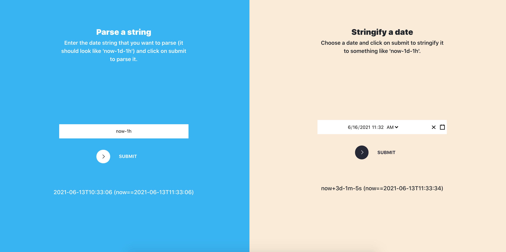

# DateTime Parser and Stringifier

This is the backend code of the Date Time API in https://ancient-scrubland-17264.herokuapp.com



`DateTimeAPI` contains two main methods: `parse` and `stringify`.

- `parse` is used to parse shorthand dates that looks like 'now-1d/d' (a syntax used in Elastic Search range queries).

- `stringify` is used to stringify a date to the corresponding shorthand syntax.

Those APIs are deployed on AWS Lambda + API Gateway.

## Glossary
### Units
This is an exhaustive list of units of time:
```
d day
M month
y year
h hour
m minute
s second
```

### Operators
This is an exhaustive list of operators:
```
- subtract
+ add
/{unit} round to closest unit
```